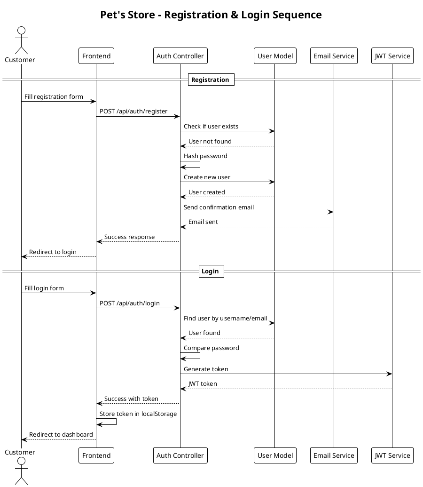
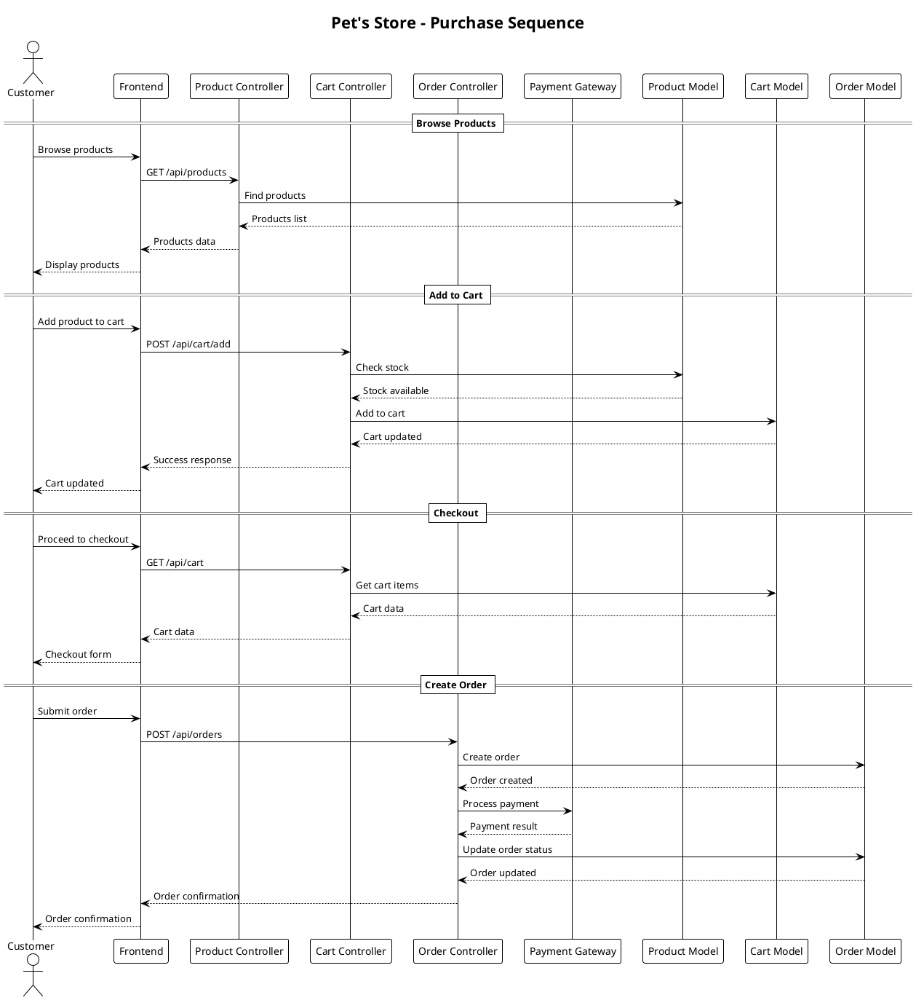
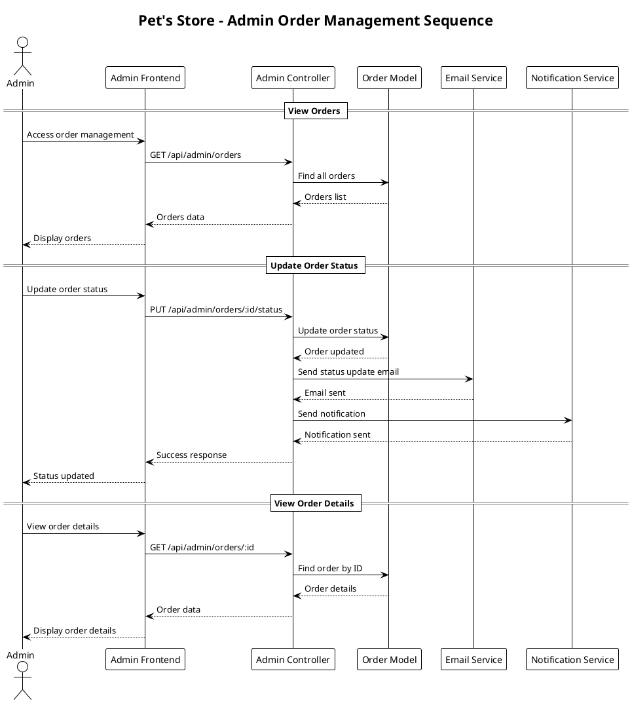
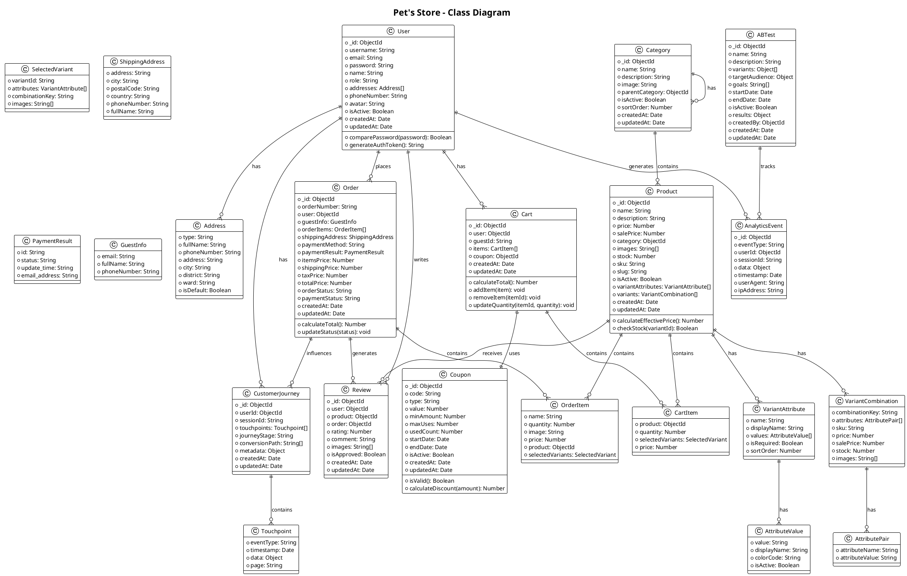
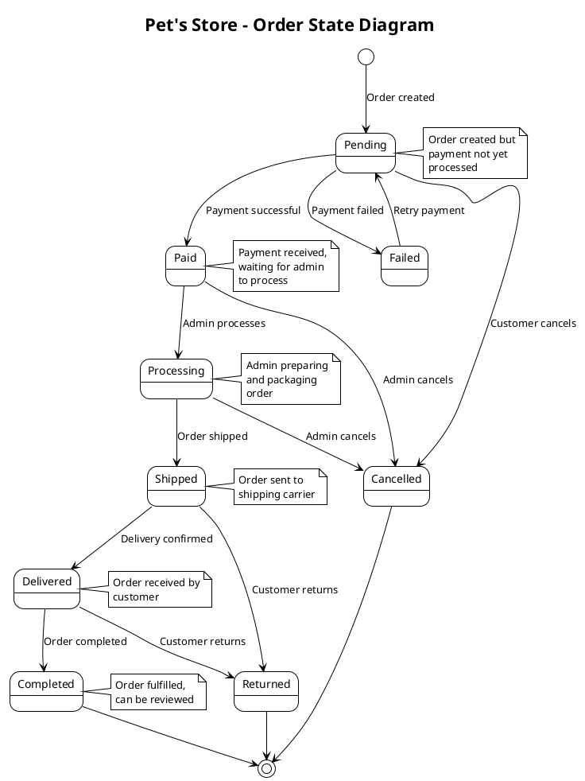
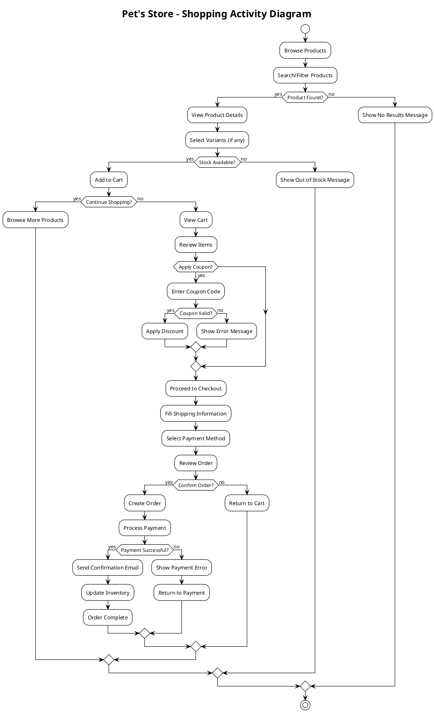

# 🐾 PHÂN TÍCH VÀ THIẾT KẾ HỆ THỐNG THƯƠNG MẠI ĐIỆN TỬ PET'S STORE

## 📋 MỤC LỤC
1. [Giai đoạn 1: Phân tích Use Case](#giai-đoạn-1-phân-tích-use-case)
2. [Giai đoạn 2: Sơ đồ UML](#giai-đoạn-2-sơ-đồ-uml)

---

## 🎯 GIAI ĐOẠN 1: PHÂN TÍCH USE CASE

### 👤 TÁC NHÂN (ACTORS)

#### 1. Quản trị viên (Admin)
- **Mô tả**: Người quản lý toàn bộ hệ thống, có quyền truy cập vào tất cả chức năng quản trị
- **Đặc điểm**: Có quyền cao nhất trong hệ thống, quản lý người dùng, sản phẩm, đơn hàng, và báo cáo

#### 2. Khách hàng (Buyer)
- **Mô tả**: Người sử dụng mua sản phẩm từ cửa hàng
- **Đặc điểm**: Có thể là khách hàng đã đăng ký hoặc khách hàng không đăng ký (guest)

---

### 📝 USE CASES CHI TIẾT

## 🔐 QUẢN LÝ XÁC THỰC VÀ PHÂN QUYỀN

### UC-001: Đăng ký tài khoản khách hàng
**Tác nhân chính**: Khách hàng  
**Tác nhân phụ**: Hệ thống email

**Điều kiện tiên quyết**: 
- Khách hàng chưa có tài khoản trong hệ thống
- Email chưa được sử dụng

**Luồng chính**:
1. Khách hàng truy cập trang đăng ký
2. Hệ thống hiển thị form đăng ký
3. Khách hàng nhập thông tin: username, email, password, name
4. Hệ thống validate dữ liệu đầu vào
5. Hệ thống kiểm tra username và email chưa tồn tại
6. Hệ thống mã hóa password
7. Hệ thống tạo tài khoản mới với role "customer"
8. Hệ thống gửi email xác nhận (nếu có)
9. Hệ thống chuyển hướng đến trang đăng nhập

**Luồng thay thế**:
- 3a. Dữ liệu không hợp lệ: Hệ thống hiển thị thông báo lỗi
- 5a. Username/email đã tồn tại: Hệ thống hiển thị thông báo lỗi
- 8a. Gửi email thất bại: Hệ thống ghi log lỗi nhưng vẫn tạo tài khoản

**Kết quả sau cùng**: Tài khoản khách hàng được tạo thành công

---

### UC-002: Đăng nhập hệ thống
**Tác nhân chính**: Khách hàng, Admin  
**Tác nhân phụ**: Hệ thống JWT

**Điều kiện tiên quyết**: 
- Tài khoản đã tồn tại trong hệ thống

**Luồng chính**:
1. Người dùng truy cập trang đăng nhập
2. Hệ thống hiển thị form đăng nhập
3. Người dùng nhập username/email và password
4. Hệ thống validate dữ liệu đầu vào
5. Hệ thống tìm kiếm tài khoản theo username/email
6. Hệ thống so sánh password đã mã hóa
7. Hệ thống tạo JWT token
8. Hệ thống lưu token vào localStorage
9. Hệ thống chuyển hướng dựa trên role:
   - Admin → Dashboard admin
   - Customer → Trang chủ

**Luồng thay thế**:
- 3a. Dữ liệu không hợp lệ: Hệ thống hiển thị thông báo lỗi
- 5a. Tài khoản không tồn tại: Hệ thống hiển thị thông báo lỗi
- 6a. Password không đúng: Hệ thống hiển thị thông báo lỗi

**Kết quả sau cùng**: Người dùng đăng nhập thành công và được cấp quyền truy cập

---

### UC-003: Đăng xuất hệ thống
**Tác nhân chính**: Khách hàng, Admin

**Điều kiện tiên quyết**: 
- Người dùng đã đăng nhập

**Luồng chính**:
1. Người dùng click nút đăng xuất
2. Hệ thống xóa JWT token khỏi localStorage
3. Hệ thống chuyển hướng đến trang đăng nhập

**Kết quả sau cùng**: Người dùng đã đăng xuất và không còn quyền truy cập

---

## 🛍️ QUẢN LÝ SẢN PHẨM

### UC-004: Duyệt danh mục sản phẩm
**Tác nhân chính**: Khách hàng

**Điều kiện tiên quyết**: 
- Không có

**Luồng chính**:
1. Khách hàng truy cập trang sản phẩm
2. Hệ thống hiển thị danh sách sản phẩm với phân trang
3. Hệ thống hiển thị bộ lọc: danh mục, giá, đánh giá
4. Khách hàng có thể áp dụng bộ lọc
5. Hệ thống cập nhật danh sách sản phẩm theo bộ lọc

**Luồng thay thế**:
- 2a. Không có sản phẩm: Hệ thống hiển thị thông báo "Không tìm thấy sản phẩm"

**Kết quả sau cùng**: Khách hàng xem được danh sách sản phẩm phù hợp

---

### UC-005: Xem chi tiết sản phẩm
**Tác nhân chính**: Khách hàng

**Điều kiện tiên quyết**: 
- Sản phẩm tồn tại trong hệ thống

**Luồng chính**:
1. Khách hàng click vào sản phẩm
2. Hệ thống hiển thị trang chi tiết sản phẩm
3. Hệ thống hiển thị: hình ảnh, tên, giá, mô tả, đánh giá, variants
4. Khách hàng có thể chọn variants (màu sắc, kích thước)
5. Khách hàng có thể thêm vào giỏ hàng

**Luồng thay thế**:
- 1a. Sản phẩm không tồn tại: Hệ thống chuyển hướng đến trang 404

**Kết quả sau cùng**: Khách hàng xem được thông tin chi tiết sản phẩm

---

### UC-006: Tìm kiếm sản phẩm
**Tác nhân chính**: Khách hàng

**Điều kiện tiên quyết**: 
- Không có

**Luồng chính**:
1. Khách hàng nhập từ khóa tìm kiếm
2. Hệ thống thực hiện tìm kiếm theo tên, mô tả, danh mục
3. Hệ thống hiển thị kết quả tìm kiếm
4. Khách hàng có thể áp dụng bộ lọc bổ sung

**Luồng thay thế**:
- 3a. Không tìm thấy kết quả: Hệ thống hiển thị thông báo và gợi ý từ khóa

**Kết quả sau cùng**: Khách hàng tìm thấy sản phẩm phù hợp

---

### UC-007: Quản lý sản phẩm (Admin)
**Tác nhân chính**: Admin

**Điều kiện tiên quyết**: 
- Admin đã đăng nhập

**Luồng chính**:
1. Admin truy cập trang quản lý sản phẩm
2. Hệ thống hiển thị danh sách sản phẩm với phân trang
3. Admin có thể thực hiện các thao tác:
   - Thêm sản phẩm mới
   - Chỉnh sửa sản phẩm
   - Xóa sản phẩm
   - Quản lý variants
   - Upload hình ảnh

**Luồng thay thế**:
- 2a. Không có sản phẩm: Hệ thống hiển thị thông báo và nút thêm sản phẩm

**Kết quả sau cùng**: Admin quản lý được danh sách sản phẩm

---

## 🛒 QUẢN LÝ GIỎ HÀNG

### UC-008: Thêm sản phẩm vào giỏ hàng
**Tác nhân chính**: Khách hàng

**Điều kiện tiên quyết**: 
- Sản phẩm tồn tại và còn hàng

**Luồng chính**:
1. Khách hàng chọn sản phẩm và variants
2. Khách hàng click "Thêm vào giỏ hàng"
3. Hệ thống kiểm tra tồn kho
4. Hệ thống thêm sản phẩm vào giỏ hàng
5. Hệ thống cập nhật số lượng trong giỏ hàng
6. Hệ thống hiển thị thông báo thành công

**Luồng thay thế**:
- 3a. Hết hàng: Hệ thống hiển thị thông báo "Hết hàng"
- 4a. Sản phẩm đã có trong giỏ: Hệ thống tăng số lượng

**Kết quả sau cùng**: Sản phẩm được thêm vào giỏ hàng

---

### UC-009: Quản lý giỏ hàng
**Tác nhân chính**: Khách hàng

**Điều kiện tiên quyết**: 
- Giỏ hàng có ít nhất 1 sản phẩm

**Luồng chính**:
1. Khách hàng truy cập trang giỏ hàng
2. Hệ thống hiển thị danh sách sản phẩm trong giỏ hàng
3. Khách hàng có thể:
   - Thay đổi số lượng
   - Xóa sản phẩm
   - Áp dụng mã giảm giá
4. Hệ thống tính toán tổng tiền
5. Khách hàng click "Thanh toán"

**Luồng thay thế**:
- 2a. Giỏ hàng trống: Hệ thống hiển thị thông báo và link mua sắm

**Kết quả sau cùng**: Khách hàng chuẩn bị sẵn sàng thanh toán

---

## 💳 QUẢN LÝ ĐƠN HÀNG VÀ THANH TOÁN

### UC-010: Tạo đơn hàng
**Tác nhân chính**: Khách hàng

**Điều kiện tiên quyết**: 
- Giỏ hàng có sản phẩm
- Khách hàng đã chọn địa chỉ giao hàng

**Luồng chính**:
1. Khách hàng truy cập trang thanh toán
2. Hệ thống hiển thị thông tin đơn hàng
3. Khách hàng nhập thông tin giao hàng
4. Khách hàng chọn phương thức thanh toán
5. Hệ thống tính toán phí vận chuyển và thuế
6. Khách hàng xác nhận đơn hàng
7. Hệ thống tạo đơn hàng với trạng thái "Pending"
8. Hệ thống chuyển hướng đến cổng thanh toán

**Luồng thay thế**:
- 3a. Thông tin không hợp lệ: Hệ thống hiển thị thông báo lỗi
- 7a. Tạo đơn hàng thất bại: Hệ thống hiển thị thông báo lỗi

**Kết quả sau cùng**: Đơn hàng được tạo và chờ thanh toán

---

### UC-011: Xử lý thanh toán
**Tác nhân chính**: Hệ thống thanh toán

**Điều kiện tiên quyết**: 
- Đơn hàng đã được tạo

**Luồng chính**:
1. Hệ thống chuyển hướng đến cổng thanh toán
2. Khách hàng thực hiện thanh toán
3. Cổng thanh toán xử lý giao dịch
4. Cổng thanh toán gửi kết quả về hệ thống
5. Hệ thống cập nhật trạng thái đơn hàng:
   - Thành công → "Paid"
   - Thất bại → "Failed"
6. Hệ thống gửi email xác nhận

**Luồng thay thế**:
- 5a. Thanh toán thất bại: Hệ thống cho phép thử lại

**Kết quả sau cùng**: Đơn hàng được thanh toán hoặc thất bại

---

### UC-012: Quản lý đơn hàng (Admin)
**Tác nhân chính**: Admin

**Điều kiện tiên quyết**: 
- Admin đã đăng nhập

**Luồng chính**:
1. Admin truy cập trang quản lý đơn hàng
2. Hệ thống hiển thị danh sách đơn hàng với phân trang
3. Admin có thể:
   - Xem chi tiết đơn hàng
   - Cập nhật trạng thái đơn hàng
   - Cập nhật trạng thái thanh toán
   - In hóa đơn
   - Gửi email thông báo

**Luồng thay thế**:
- 2a. Không có đơn hàng: Hệ thống hiển thị thông báo

**Kết quả sau cùng**: Admin quản lý được tất cả đơn hàng

---

## 👥 QUẢN LÝ NGƯỜI DÙNG

### UC-013: Quản lý người dùng (Admin)
**Tác nhân chính**: Admin

**Điều kiện tiên quyết**: 
- Admin đã đăng nhập

**Luồng chính**:
1. Admin truy cập trang quản lý người dùng
2. Hệ thống hiển thị danh sách người dùng với phân trang
3. Admin có thể:
   - Xem thông tin chi tiết người dùng
   - Cập nhật thông tin người dùng
   - Thay đổi role người dùng
   - Khóa/mở khóa tài khoản
   - Xóa tài khoản

**Luồng thay thế**:
- 2a. Không có người dùng: Hệ thống hiển thị thông báo

**Kết quả sau cùng**: Admin quản lý được tất cả người dùng

---

### UC-014: Quản lý hồ sơ cá nhân
**Tác nhân chính**: Khách hàng

**Điều kiện tiên quyết**: 
- Khách hàng đã đăng nhập

**Luồng chính**:
1. Khách hàng truy cập trang hồ sơ cá nhân
2. Hệ thống hiển thị thông tin cá nhân
3. Khách hàng có thể:
   - Cập nhật thông tin cá nhân
   - Thay đổi mật khẩu
   - Quản lý địa chỉ giao hàng
   - Xem lịch sử đơn hàng
   - Xem đánh giá sản phẩm

**Kết quả sau cùng**: Khách hàng quản lý được thông tin cá nhân

---

## 📊 BÁO CÁO VÀ PHÂN TÍCH

### UC-015: Xem báo cáo tổng quan (Admin)
**Tác nhân chính**: Admin

**Điều kiện tiên quyết**: 
- Admin đã đăng nhập

**Luồng chính**:
1. Admin truy cập trang dashboard
2. Hệ thống hiển thị các chỉ số:
   - Tổng doanh thu
   - Số đơn hàng
   - Số khách hàng
   - Số sản phẩm
3. Hệ thống hiển thị biểu đồ thống kê
4. Admin có thể chọn khoảng thời gian

**Kết quả sau cùng**: Admin nắm được tình hình kinh doanh

---

### UC-016: Phân tích chi tiết (Admin)
**Tác nhân chính**: Admin

**Điều kiện tiên quyết**: 
- Admin đã đăng nhập

**Luồng chính**:
1. Admin truy cập trang phân tích
2. Hệ thống hiển thị các tab phân tích:
   - Doanh thu theo thời gian
   - Sản phẩm bán chạy
   - Khách hàng tiềm năng
   - Tỷ lệ chuyển đổi
3. Admin có thể xuất báo cáo

**Kết quả sau cùng**: Admin có dữ liệu chi tiết để ra quyết định

---

## 🎫 QUẢN LÝ MÃ GIẢM GIÁ

### UC-017: Quản lý mã giảm giá (Admin)
**Tác nhân chính**: Admin

**Điều kiện tiên quyết**: 
- Admin đã đăng nhập

**Luồng chính**:
1. Admin truy cập trang quản lý mã giảm giá
2. Hệ thống hiển thị danh sách mã giảm giá
3. Admin có thể:
   - Tạo mã giảm giá mới
   - Chỉnh sửa mã giảm giá
   - Xóa mã giảm giá
   - Xem thống kê sử dụng

**Kết quả sau cùng**: Admin quản lý được các mã giảm giá

---

### UC-018: Áp dụng mã giảm giá
**Tác nhân chính**: Khách hàng

**Điều kiện tiên quyết**: 
- Có sản phẩm trong giỏ hàng
- Mã giảm giá còn hiệu lực

**Luồng chính**:
1. Khách hàng nhập mã giảm giá
2. Hệ thống kiểm tra tính hợp lệ của mã
3. Hệ thống áp dụng giảm giá
4. Hệ thống cập nhật tổng tiền

**Luồng thay thế**:
- 2a. Mã không hợp lệ: Hệ thống hiển thị thông báo lỗi

**Kết quả sau cùng**: Mã giảm giá được áp dụng thành công

---

## 📝 QUẢN LÝ ĐÁNH GIÁ

### UC-019: Đánh giá sản phẩm
**Tác nhân chính**: Khách hàng

**Điều kiện tiên quyết**: 
- Khách hàng đã mua sản phẩm
- Đơn hàng đã được giao thành công

**Luồng chính**:
1. Khách hàng truy cập trang đánh giá
2. Hệ thống hiển thị danh sách sản phẩm có thể đánh giá
3. Khách hàng chọn sản phẩm và đánh giá
4. Khách hàng nhập nội dung đánh giá
5. Hệ thống lưu đánh giá
6. Hệ thống cập nhật điểm trung bình sản phẩm

**Kết quả sau cùng**: Đánh giá được lưu và hiển thị

---

---

## 🎨 GIAI ĐOẠN 2: SƠ ĐỒ UML

### 1. SƠ ĐỒ USE CASES (USE CASES DIAGRAM)

```plantuml
@startuml PetStore_UseCaseDiagram
!theme plain
skinparam actorStyle awesome

title Pet's Store - Use Cases Diagram

actor "Admin" as admin
actor "Customer" as customer
actor "Guest" as guest
actor "Payment Gateway" as payment
actor "Email System" as email

rectangle "Pet's Store E-Commerce System" {
    
    package "Authentication & Authorization" {
        usecase "UC-001: Register Account" as UC001
        usecase "UC-002: Login" as UC002
        usecase "UC-003: Logout" as UC003
        usecase "UC-013: Manage Users" as UC013
    }
    
    package "Product Management" {
        usecase "UC-004: Browse Products" as UC004
        usecase "UC-005: View Product Details" as UC005
        usecase "UC-006: Search Products" as UC006
        usecase "UC-007: Manage Products" as UC007
    }
    
    package "Shopping Cart" {
        usecase "UC-008: Add to Cart" as UC008
        usecase "UC-009: Manage Cart" as UC009
    }
    
    package "Order & Payment" {
        usecase "UC-010: Create Order" as UC010
        usecase "UC-011: Process Payment" as UC011
        usecase "UC-012: Manage Orders" as UC012
    }
    
    package "User Profile" {
        usecase "UC-014: Manage Profile" as UC014
    }
    
    package "Analytics & Reports" {
        usecase "UC-015: View Dashboard" as UC015
        usecase "UC-016: Detailed Analytics" as UC016
    }
    
    package "Coupon Management" {
        usecase "UC-017: Manage Coupons" as UC017
        usecase "UC-018: Apply Coupon" as UC018
    }
    
    package "Reviews" {
        usecase "UC-019: Review Products" as UC019
    }
}

' Admin relationships
admin --> UC002
admin --> UC003
admin --> UC007
admin --> UC012
admin --> UC013
admin --> UC015
admin --> UC016
admin --> UC017

' Customer relationships
customer --> UC002
customer --> UC003
customer --> UC004
customer --> UC005
customer --> UC006
customer --> UC008
customer --> UC009
customer --> UC010
customer --> UC014
customer --> UC018
customer --> UC019

' Guest relationships
guest --> UC004
guest --> UC005
guest --> UC006
guest --> UC008
guest --> UC009
guest --> UC010

' External system relationships
payment --> UC011
email --> UC001
email --> UC010

@enduml
```

### 2. SƠ ĐỒ TRÌNH TỰ (SEQUENCE DIAGRAM)

#### 2.1. Quy trình đăng ký và đăng nhập

#### 2.2. Quy trình mua hàng

#### 2.3. Quy trình quản lý đơn hàng (Admin)

### 3. SƠ ĐỒ LỚP (CLASS DIAGRAM)

### 4. SƠ ĐỒ TRẠNG THÁI (STATE DIAGRAM)

### 5. SƠ ĐỒ HOẠT ĐỘNG (ACTIVITY DIAGRAM)

---

## 📋 KẾT LUẬN

Tài liệu phân tích và thiết kế này cung cấp một cái nhìn toàn diện về hệ thống thương mại điện tử "Pet's Store" với:

### 🎯 **Điểm mạnh của hệ thống:**
1. **Kiến trúc MERN hiện đại**: Sử dụng MongoDB, Express.js, React, Node.js
2. **Quản lý variants linh hoạt**: Hỗ trợ sản phẩm có nhiều thuộc tính (màu sắc, kích thước)
3. **Hệ thống phân quyền rõ ràng**: Admin và Customer với các quyền khác nhau
4. **Analytics toàn diện**: Theo dõi hành vi người dùng và báo cáo kinh doanh
5. **Hỗ trợ khách hàng guest**: Cho phép mua hàng không cần đăng ký
6. **Quản lý mã giảm giá**: Hệ thống coupon linh hoạt
7. **Đánh giá sản phẩm**: Hệ thống review tích hợp

### 🔧 **Các thành phần chính:**
- **Frontend**: React với Redux Toolkit, responsive design
- **Backend**: Express.js với RESTful API
- **Database**: MongoDB với Mongoose ODM
- **Authentication**: JWT + Passport.js
- **File Upload**: Multer + Cloudinary
- **Email**: MJML templates
- **Analytics**: Multi-platform tracking

### 📈 **Khả năng mở rộng:**
- Hỗ trợ A/B testing
- Customer journey tracking
- Predictive analytics
- Multi-language support (i18n)
- Docker containerization
- CI/CD pipeline

Hệ thống được thiết kế để đáp ứng nhu cầu của một cửa hàng thú cưng hiện đại với khả năng mở rộng và bảo trì cao.