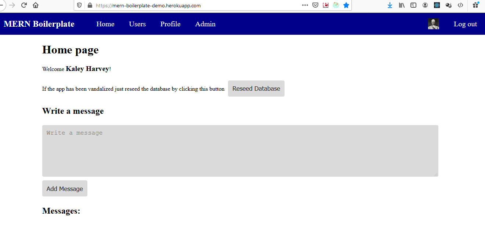
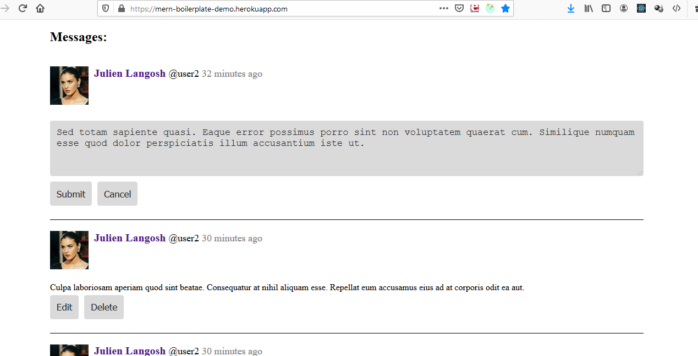
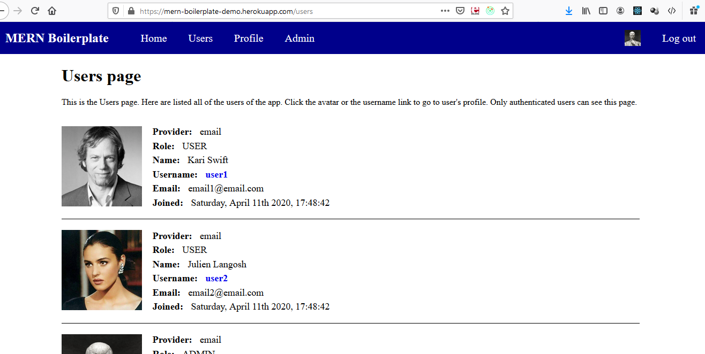
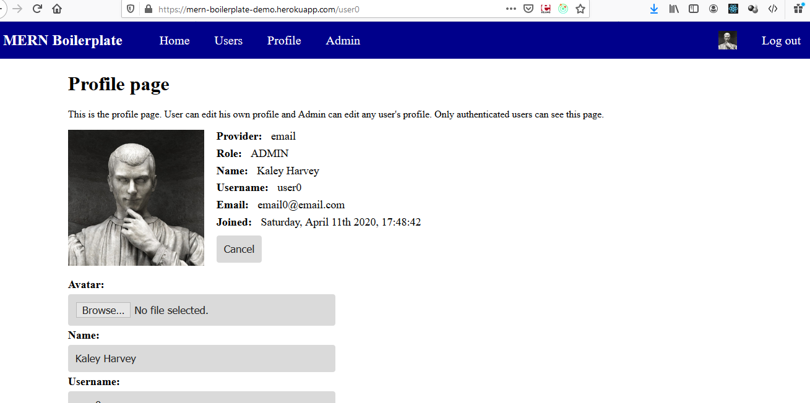
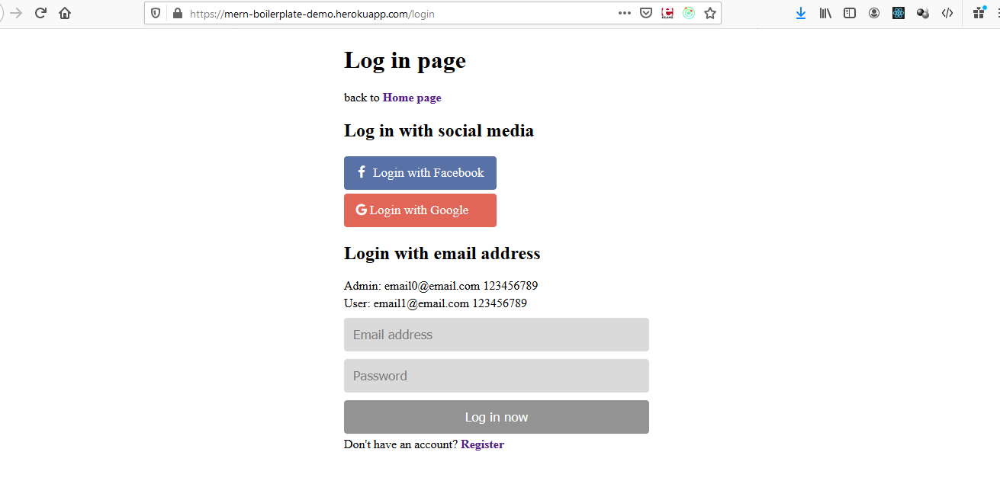
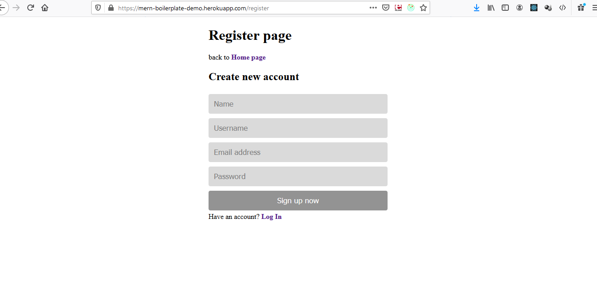

# 🐾 Petopia Store - Pet Shop E-Commerce Platform

> A modern, full-stack MERN (MongoDB, Express.js, React, Node.js) e-commerce application designed specifically for pet stores and pet product retailers.

[](https://nodejs.org/)
[](https://reactjs.org/)
[](https://www.mongodb.com/)
[](https://expressjs.com/)
[](LICENSE)

## 🌟 Overview

Petopia Store is a comprehensive e-commerce solution built specifically for pet retailers. It provides a seamless shopping experience for pet owners while offering robust management tools for store administrators. The platform supports product catalogs, user management, order processing, and administrative controls.

## ✨ Key Features

### 🛒 **E-Commerce Core**
- **Product Catalog**: Browse pet products with categories, filters, and search
- **Shopping Cart**: Add, remove, and manage items before checkout
- **User Accounts**: Registration, login, profile management
- **Order Management**: Track orders from placement to delivery
- **Payment Integration**: Secure payment processing
- **Inventory Management**: Real-time stock tracking

### 👤 **User Management**
- **Customer Profiles**: Personal information, order history, preferences
- **Admin Dashboard**: Comprehensive administrative controls
- **Role-Based Access**: Customer, Staff, and Admin permission levels
- **Authentication**: JWT-based secure authentication
- **Social Login**: Google and Facebook OAuth integration

### 📱 **Modern UX/UI**
- **Responsive Design**: Optimized for mobile, tablet, and desktop
- **Real-time Updates**: Live inventory and order status updates
- **Interactive Components**: Dynamic product displays and filters
- **Loading States**: Smooth user experience with loading indicators
- **Error Handling**: Comprehensive error management and user feedback

### 🔧 **Technical Features**
- **RESTful API**: Clean, documented API endpoints
- **File Upload**: Product images and user avatars
- **Data Validation**: Client and server-side input validation
- **Search & Filtering**: Advanced product search capabilities
- **Pagination**: Efficient large dataset handling
- **Caching**: Performance optimization with intelligent caching

## 🏗️ **Architecture & Technology Stack**

### **Backend (Server)**
```
🔧 Runtime:        Node.js 16+
🚀 Framework:      Express.js 4.x
🗄️ Database:       MongoDB 5.x with Mongoose ODM
🔐 Authentication: JWT + Passport.js (Local, Google, Facebook)
✅ Validation:     Joi schema validation
📁 File Upload:    Multer middleware
🔒 Security:       Helmet, CORS, bcrypt
📧 Email:          Nodemailer integration
⚡ Performance:    Compression, rate limiting
```

### **Frontend (Client)**
```
⚛️ Library:        React 18.x with Hooks
🏪 State:          Redux Toolkit + RTK Query
🎨 Styling:        CSS3, CSS Modules, Styled Components
📱 Responsive:     Mobile-first design approach
🔄 HTTP Client:    Axios with interceptors
📋 Forms:          Formik + Yup validation
🧭 Routing:        React Router v6
🎭 UI Components:  Custom component library
```

### **DevOps & Tools**
```
🐳 Containerization: Docker & Docker Compose
☁️ Deployment:       Cloud platforms (AWS, Heroku, DigitalOcean)
🔄 CI/CD:            GitHub Actions
📊 Monitoring:       Application logging and monitoring
🔒 Security:         Environment variables, secrets management
📦 Package Manager:  npm
🧪 Testing:          Jest, React Testing Library, Supertest
🎯 Code Quality:     ESLint, Prettier, Husky
```

## 📸 Screenshots

<div align="center">

### 🏠 Homepage


### 🛍️ Product Catalog


### 👤 User Profile


### 🔐 Authentication


### ⚙️ Admin Dashboard


### 💬 User Management


</div>

## 🚀 Quick Start

### Prerequisites
Make sure you have the following installed:
- **Node.js** (v16 or higher)
- **MongoDB** (v5 or higher)
- **Git**
- **npm** or **yarn**

### 🔧 Installation

1. **Clone the repository**
```bash
git clone https://github.com/yourusername/petopia-store.git
cd petopia-store
```

2. **Install dependencies**
```bash
# Install server dependencies
cd server
npm install

# Install client dependencies
cd ../client
npm install
```

3. **Environment Configuration**

Create a `.env` file in the root directory:

```env
# Database
MONGODB_URI=mongodb://localhost:27017/petopia_store
MONGODB_URI_TEST=mongodb://localhost:27017/petopia_store_test

# JWT Configuration
JWT_SECRET=your_super_secret_jwt_key_here
JWT_EXPIRE=30d

# OAuth Configuration
GOOGLE_CLIENT_ID=your_google_client_id
GOOGLE_CLIENT_SECRET=your_google_client_secret
GOOGLE_CALLBACK_URL=/auth/google/callback

FACEBOOK_APP_ID=your_facebook_app_id
FACEBOOK_SECRET=your_facebook_secret
FACEBOOK_CALLBACK_URL=/auth/facebook/callback

# Application URLs
CLIENT_URL=http://localhost:3000
SERVER_URL=http://localhost:5000

# File Upload
UPLOAD_PATH=./public/uploads
MAX_FILE_SIZE=5000000

# Email Configuration (Optional)
SMTP_HOST=smtp.gmail.com
SMTP_PORT=587
SMTP_USER=your_email@gmail.com
SMTP_PASS=your_app_password

# Payment Integration (Optional)
STRIPE_SECRET_KEY=your_stripe_secret_key
STRIPE_PUBLISHABLE_KEY=your_stripe_publishable_key
```

4. **Database Setup**

Start MongoDB and create the database:
```bash
# Start MongoDB service
mongod

# The application will automatically create the database on first run
```

5. **Run the Application**

```bash
# Development mode (runs both client and server)
npm run dev

# Or run separately:
# Server (http://localhost:5000)
cd server && npm run server

# Client (http://localhost:3000)
cd client && npm start
```

## 🐳 Docker Deployment

### Development with Docker
```bash
# Build and run with Docker Compose
docker-compose up --build

# Run in background
docker-compose up -d
```

### Production Deployment
```bash
# Production build
docker-compose -f docker-compose.prod.yml up --build

# With environment variables
docker-compose -f docker-compose.prod.yml --env-file .env.prod up -d
```

## 📚 API Documentation

### Authentication Endpoints
```
POST   /api/auth/register     # User registration
POST   /api/auth/login        # User login
GET    /api/auth/logout       # User logout
GET    /api/auth/me           # Get current user
PUT    /api/auth/profile      # Update user profile
```

### Product Endpoints
```
GET    /api/products          # Get all products
GET    /api/products/:id      # Get single product
POST   /api/products          # Create product (Admin)
PUT    /api/products/:id      # Update product (Admin)
DELETE /api/products/:id      # Delete product (Admin)
```

### User Management (Admin)
```
GET    /api/users             # Get all users
GET    /api/users/:id         # Get single user
PUT    /api/users/:id         # Update user
DELETE /api/users/:id         # Delete user
```

### Orders & Cart
```
GET    /api/orders            # Get user orders
POST   /api/orders            # Create new order  
GET    /api/cart              # Get user cart
POST   /api/cart              # Add to cart
PUT    /api/cart/:id          # Update cart item
DELETE /api/cart/:id          # Remove from cart
```

For detailed API documentation, visit `/api/docs` when running the server.

## 🧪 Testing

```bash
# Run all tests
npm test

# Run server tests only
cd server && npm test

# Run client tests only  
cd client && npm test

# Run tests with coverage
npm run test:coverage

# Run e2e tests
npm run test:e2e
```

## 📁 Project Structure

```
petopia-store/
├── 📁 client/                 # React frontend application
├── 📁 server/                 # Express backend application  
├── 📁 docs/                   # Project documentation
├── 📁 tests/                  # Testing suites
├── 📁 scripts/                # Build and deployment scripts
├── 📁 screenshots/            # Application screenshots
├── 🐳 docker-compose.yml      # Docker development setup
├── 🐳 docker-compose.prod.yml # Docker production setup
├── 📄 README.md               # Project documentation
└── 📄 package.json            # Root package configuration
```

For detailed structure information, see [Project Structure Documentation](docs/PROJECT_STRUCTURE.md).

## 🤝 Contributing

We welcome contributions! Please follow these steps:

1. **Fork the repository**
2. **Create a feature branch**: `git checkout -b feature/amazing-feature`
3. **Make your changes** and ensure tests pass
4. **Commit your changes**: `git commit -m 'Add amazing feature'`
5. **Push to branch**: `git push origin feature/amazing-feature`
6. **Open a Pull Request**

### Development Guidelines
- Follow the existing code style and conventions
- Write tests for new features
- Update documentation as needed
- Ensure all tests pass before submitting PR

## 📋 Roadmap

### Version 2.0 (Planned)
- [ ] **Advanced Search**: AI-powered product recommendations
- [ ] **Mobile App**: React Native mobile application
- [ ] **Multi-vendor**: Support for multiple store vendors
- [ ] **Advanced Analytics**: Detailed sales and user analytics
- [ ] **Subscription Service**: Recurring pet supply deliveries
- [ ] **Veterinary Integration**: Connect with local veterinary services

### Version 1.5 (In Progress)
- [ ] **Payment Integration**: Stripe and PayPal integration
- [ ] **Email Notifications**: Order confirmations and updates
- [ ] **Reviews & Ratings**: Product review system
- [ ] **Wishlist Feature**: Save favorite products
- [ ] **Advanced Filtering**: Price, brand, category filters

## 🔒 Security

- JWT token-based authentication
- Password hashing with bcrypt
- Input validation and sanitization
- CORS configuration
- Rate limiting on API endpoints
- File upload restrictions
- SQL injection prevention
- XSS protection

## 📊 Performance

- Database query optimization
- Image compression and optimization
- Lazy loading for components
- Code splitting and bundling
- Caching strategies
- CDN integration ready
- Performance monitoring

## 🌐 Browser Support

- **Chrome** (latest 2 versions)
- **Firefox** (latest 2 versions)  
- **Safari** (latest 2 versions)
- **Edge** (latest 2 versions)
- **Mobile browsers** (iOS Safari, Chrome Mobile)

## 📝 License

This project is licensed under the **MIT License** - see the [LICENSE](LICENSE) file for details.

## 👨‍💻 Author

**Your Name**
- GitHub: [@yourusername](https://github.com/yourusername)
- LinkedIn: [Your LinkedIn](https://linkedin.com/in/yourprofile)
- Email: your.email@example.com

## 🙏 Acknowledgments

- **React Team** for the amazing React framework
- **Express.js** for the robust backend framework
- **MongoDB** for the flexible database solution
- **Open Source Community** for countless helpful libraries
- **Pet Store Industry** for inspiration and requirements

## 💬 Support

If you have any questions or need help:

1. **Check the documentation** in the `/docs` folder
2. **Search existing issues** on GitHub
3. **Create a new issue** if you found a bug
4. **Join our Discord** for community support
5. **Email support** at support@petopia-store.com

---

<div align="center">

**Made with ❤️ for pet lovers everywhere**

[⭐ Star this repository](https://github.com/yourusername/petopia-store) if you found it helpful!

</div>
