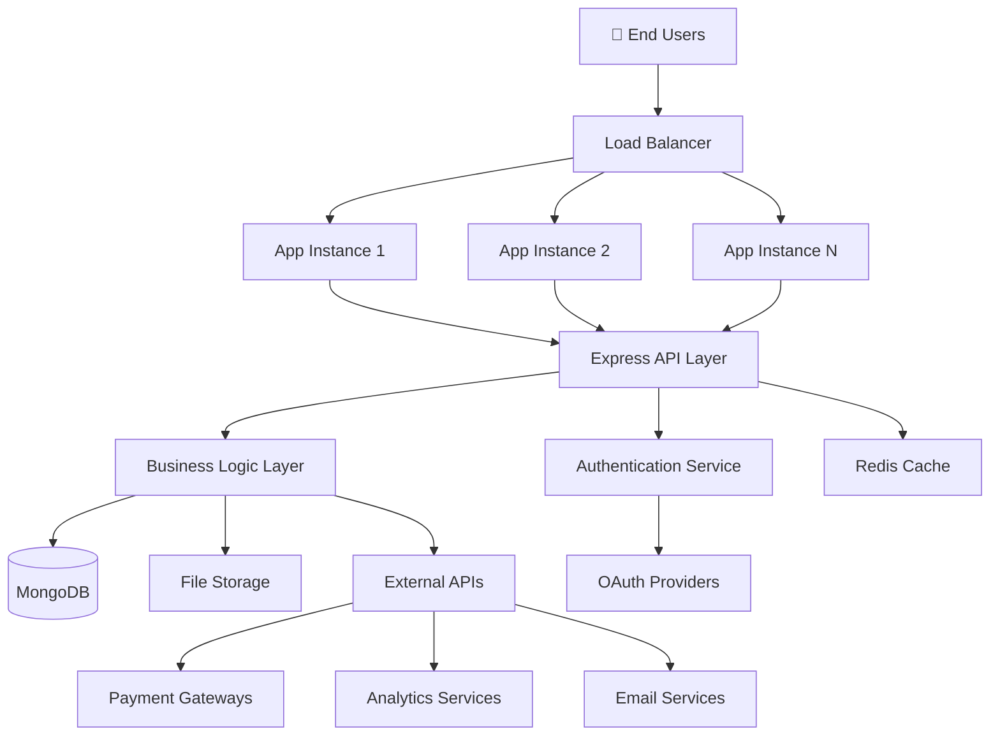

# TECHNICAL ARCHITECTURE ANALYSIS
## Phân tích Kiến trúc Kỹ thuật Chi tiết

### 1. System Architecture Overview

#### 1.1. High-Level Architecture



#### 1.2. Technology Stack Deep Dive

**Frontend Architecture:**
```
React 18.3.1 Application
├── Presentation Layer
│   ├── Components (Functional + Hooks)
│   ├── Pages (Route-based containers)
│   └── Layouts (Common UI structures)
├── State Management Layer  
│   ├── Redux Store (Global state)
│   ├── Context API (Component state)
│   └── Local State (Component-specific)
├── Service Layer
│   ├── API Services (HTTP communication)
│   ├── Utilities (Helper functions)
│   └── Constants (Configuration)
└── Asset Layer
    ├── Styles (CSS/SCSS)
    ├── Images (Static assets)
    └── Fonts (Typography)
```

**Backend Architecture:**
```
Express.js 4.21.2 Application
├── Presentation Layer
│   ├── Routes (API endpoints)
│   ├── Middleware (Cross-cutting concerns)
│   └── Controllers (Request handlers)
├── Business Logic Layer
│   ├── Services (Domain logic)
│   ├── Validators (Input validation)
│   └── Utils (Business utilities)
├── Data Access Layer
│   ├── Models (Mongoose schemas)
│   ├── Repositories (Data operations)
│   └── Migrations (Schema changes)
└── Infrastructure Layer
    ├── Database (MongoDB connection)
    ├── Storage (File management)
    └── External APIs (Third-party integration)
```

### 2. Component Architecture Analysis

#### 2.1. React Component Hierarchy

```javascript
// Component structure analysis
src/
├── components/                    # 15 reusable components
│   ├── Admin/                    # 5 admin components
│   │   ├── Dashboard/
│   │   ├── ProductManagement/
│   │   ├── UserManagement/
│   │   ├── OrderManagement/
│   │   └── Analytics/
│   ├── Common/                   # 7 shared components
│   │   ├── Loader/
│   │   ├── Message/
│   │   ├── Toast/
│   │   ├── Modal/
│   │   ├── Breadcrumb/
│   │   ├── Pagination/
│   │   └── ProtectedRoute/
│   └── Feature/                  # 3 feature components
│       ├── ProductCard/
│       ├── CartItem/
│       └── ReviewItem/
├── pages/                        # 12 page components
│   ├── Home/
│   ├── Products/
│   ├── ProductDetail/
│   ├── Cart/
│   ├── Checkout/
│   ├── Orders/
│   ├── Profile/
│   ├── Login/
│   ├── Register/
│   ├── About/
│   ├── Contact/
│   └── Admin/
└── layout/                       # 3 layout components
    ├── Header/
    ├── Footer/
    └── Sidebar/
```

#### 2.2. Component Design Patterns

**1. Compound Component Pattern**
```javascript
// ProductCard component example
const ProductCard = ({ product }) => {
  return (
    <Card>
      <ProductCard.Image src={product.image} />
      <ProductCard.Content>
        <ProductCard.Title>{product.name}</ProductCard.Title>
        <ProductCard.Price price={product.price} />
        <ProductCard.Rating rating={product.rating} />
      </ProductCard.Content>
      <ProductCard.Actions>
        <ProductCard.AddToCart product={product} />
        <ProductCard.ViewDetails productId={product._id} />
      </ProductCard.Actions>
    </Card>
  );
};
```

**2. Higher-Order Component Pattern**
```javascript
// ProtectedRoute HOC
const withAuthProtection = (WrappedComponent) => {
  return (props) => {
    const { user, loading } = useAuth();
    
    if (loading) return <Loader />;
    if (!user) return <Navigate to="/login" />;
    
    return <WrappedComponent {...props} />;
  };
};

// Usage
const ProtectedDashboard = withAuthProtection(Dashboard);
```

**3. Custom Hooks Pattern**
```javascript
// Custom hooks for business logic
const useProducts = (filters) => {
  const [products, setProducts] = useState([]);
  const [loading, setLoading] = useState(false);
  const [error, setError] = useState(null);

  useEffect(() => {
    fetchProducts(filters);
  }, [filters]);

  const fetchProducts = async (filters) => {
    try {
      setLoading(true);
      const response = await productService.getProducts(filters);
      setProducts(response.data);
    } catch (err) {
      setError(err.message);
    } finally {
      setLoading(false);
    }
  };

  return { products, loading, error, refetch: fetchProducts };
};
```

### 3. Database Architecture

#### 3.1. MongoDB Schema Design

**1. Product Collection Schema**
```javascript
// Advanced product schema with variant support
const productSchema = new Schema({
  // Basic Information
  name: { type: String, required: true, index: true },
  slug: { type: String, unique: true, index: true },
  description: { type: String, required: true },
  shortDescription: { type: String, maxlength: 200 },
  
  // Categorization
  category: { 
    type: Schema.Types.ObjectId, 
    ref: 'Category', 
    required: true,
    index: true 
  },
  parentCategory: { 
    type: Schema.Types.ObjectId, 
    ref: 'ParentCategory',
    index: true 
  },
  tags: [{ type: String, index: true }],
  
  // Variant System (Advanced Feature)
  variantAttributes: [{
    name: String,                    // "Color", "Size"
    displayName: String,             // Localized display name
    values: [{
      value: String,                 // "red", "large"
      displayName: String,           // Localized value name
      colorCode: String,             // For color variants
      isActive: { type: Boolean, default: true }
    }],
    isRequired: { type: Boolean, default: true },
    sortOrder: { type: Number, default: 0 }
  }],
  
  // Pre-computed variant combinations for performance
  combinations: [{
    key: String,                     // "red_large"
    attributes: Map,                 // { color: "red", size: "large" }
    price: { type: Number, required: true },
    salePrice: Number,
    stock: { type: Number, default: 0 },
    sku: { type: String, unique: true },
    isActive: { type: Boolean, default: true },
    images: [String]
  }],
  
  // Default pricing (fallback)
  basePrice: { type: Number, required: true, index: true },
  baseSalePrice: Number,
  
  // Media
  images: [String],
  thumbnailImage: String,
  
  // Business Logic
  isPublished: { type: Boolean, default: false, index: true },
  isFeatured: { type: Boolean, default: false, index: true },
  weight: Number,
  dimensions: {
    length: Number,
    width: Number,
    height: Number
  },
  
  // SEO
  seoTitle: String,
  seoDescription: String,
  seoKeywords: [String],
  
  // Aggregated data (for performance)
  totalStock: { type: Number, default: 0 },
  averageRating: { type: Number, default: 0 },
  numReviews: { type: Number, default: 0 },
  totalSales: { type: Number, default: 0 },
  
  // Timestamps
  createdAt: { type: Date, default: Date.now, index: true },
  updatedAt: { type: Date, default: Date.now }
});

// Compound indexes for performance
productSchema.index({ category: 1, isPublished: 1 });
productSchema.index({ basePrice: 1, isPublished: 1 });
productSchema.index({ averageRating: -1, numReviews: -1 });
productSchema.index({ createdAt: -1 });
productSchema.index({ name: 'text', description: 'text' });
```

**2. User Collection Schema**
```javascript
const userSchema = new Schema({
  // Authentication
  email: { 
    type: String, 
    required: true, 
    unique: true, 
    lowercase: true,
    index: true 
  },
  password: { type: String, required: true },
  
  // Authorization
  role: {
    type: String,
    enum: ['customer', 'staff', 'admin'],
    default: 'customer',
    index: true
  },
  
  // Profile Information
  profile: {
    firstName: { type: String, required: true },
    lastName: { type: String, required: true },
    phoneNumber: {
      type: String,
      validate: {
        validator: (v) => /^[0-9]{10}$/.test(v),
        message: 'Invalid phone number format'
      }
    },
    dateOfBirth: Date,
    gender: { type: String, enum: ['male', 'female', 'other'] },
    avatar: String
  },
  
  // Address Management
  addresses: [{
    type: { 
      type: String, 
      enum: ['home', 'work', 'other'], 
      default: 'home' 
    },
    fullName: String,
    phoneNumber: String,
    address: { type: String, required: true },
    city: String,
    district: String,
    ward: String,
    postalCode: String,
    isDefault: { type: Boolean, default: false }
  }],
  
  // User Preferences
  preferences: {
    language: { type: String, default: 'vi' },
    currency: { type: String, default: 'VND' },
    notifications: {
      email: { type: Boolean, default: true },
      sms: { type: Boolean, default: false },
      push: { type: Boolean, default: true }
    },
    theme: { type: String, default: 'light' }
  },
  
  // Account Status
  isActive: { type: Boolean, default: true },
  isEmailVerified: { type: Boolean, default: false },
  isPhoneVerified: { type: Boolean, default: false },
  
  // Security
  lastLogin: Date,
  passwordResetToken: String,
  passwordResetExpires: Date,
  emailVerificationToken: String,
  loginAttempts: { type: Number, default: 0 },
  lockUntil: Date,
  
  // OAuth Integration
  googleId: String,
  facebookId: String,
  
  // Analytics
  lastActivity: { type: Date, default: Date.now },
  registrationSource: String,
  
  // Timestamps
  createdAt: { type: Date, default: Date.now },
  updatedAt: { type: Date, default: Date.now }
});

// Security indexes
userSchema.index({ email: 1 });
userSchema.index({ 'profile.phoneNumber': 1 });
userSchema.index({ role: 1, isActive: 1 });
userSchema.index({ lastActivity: -1 });
```

#### 3.2. Database Performance Optimization

**1. Indexing Strategy**
```javascript
// Performance-critical indexes
db.products.createIndex({ 
  "category": 1, 
  "isPublished": 1, 
  "basePrice": 1 
});

db.products.createIndex({ 
  "averageRating": -1, 
  "numReviews": -1 
});

db.orders.createIndex({ 
  "userId": 1, 
  "createdAt": -1 
});

db.cart.createIndex({ 
  "userId": 1 
}, { 
  unique: true 
});

// Text search index
db.products.createIndex({
  "name": "text",
  "description": "text",
  "tags": "text"
});
```

**2. Aggregation Pipeline Optimization**
```javascript
// Optimized product listing with ratings
const getProductsWithRatings = async (filters) => {
  return await Product.aggregate([
    // Stage 1: Match published products
    { 
      $match: { 
        isPublished: true,
        ...filters 
      } 
    },
    
    // Stage 2: Lookup reviews (with limit for performance)
    {
      $lookup: {
        from: "reviews",
        localField: "_id",
        foreignField: "productId",
        as: "reviews",
        pipeline: [
          { $limit: 1000 },  // Prevent excessive joins
          { $project: { rating: 1 } }
        ]
      }
    },
    
    // Stage 3: Calculate aggregated rating
    {
      $addFields: {
        calculatedRating: { 
          $cond: {
            if: { $gt: [{ $size: "$reviews" }, 0] },
            then: { $avg: "$reviews.rating" },
            else: 0
          }
        },
        reviewCount: { $size: "$reviews" }
      }
    },
    
    // Stage 4: Project final fields
    {
      $project: {
        name: 1,
        slug: 1,
        basePrice: 1,
        baseSalePrice: 1,
        images: 1,
        thumbnailImage: 1,
        calculatedRating: 1,
        reviewCount: 1,
        isInStock: { $gt: ["$totalStock", 0] }
      }
    },
    
    // Stage 5: Sort by relevance
    {
      $sort: {
        calculatedRating: -1,
        reviewCount: -1,
        createdAt: -1
      }
    },
    
    // Stage 6: Pagination
    { $skip: (page - 1) * limit },
    { $limit: limit }
  ]);
};
```

### 4. API Architecture Analysis

#### 4.1. RESTful API Design

**1. Resource-Based URL Structure**
```javascript
// API endpoint organization
const apiRoutes = {
  // Authentication & Authorization
  auth: {
    'POST   /api/auth/register': 'Register new user',
    'POST   /api/auth/login': 'User login',
    'POST   /api/auth/logout': 'User logout',
    'POST   /api/auth/refresh': 'Refresh access token',
    'GET    /api/auth/me': 'Get current user',
    'PUT    /api/auth/profile': 'Update user profile',
    'POST   /api/auth/forgot-password': 'Forgot password',
    'POST   /api/auth/reset-password': 'Reset password'
  },
  
  // Product Management
  products: {
    'GET    /api/products': 'List products (with filters)',
    'GET    /api/products/:id': 'Get single product',
    'POST   /api/products': 'Create product (admin)',
    'PUT    /api/products/:id': 'Update product (admin)',
    'DELETE /api/products/:id': 'Delete product (admin)',
    'GET    /api/products/:id/reviews': 'Get product reviews',
    'POST   /api/products/:id/reviews': 'Add product review'
  },
  
  // Category Management
  categories: {
    'GET    /api/categories': 'List all categories',
    'GET    /api/categories/:slug': 'Get category by slug',
    'GET    /api/categories/:id/products': 'Get products in category',
    'POST   /api/categories': 'Create category (admin)',
    'PUT    /api/categories/:id': 'Update category (admin)',
    'DELETE /api/categories/:id': 'Delete category (admin)'
  },
  
  // Shopping Cart
  cart: {
    'GET    /api/cart': 'Get user cart',
    'POST   /api/cart/add': 'Add item to cart',
    'PUT    /api/cart/items/:id': 'Update cart item quantity',
    'DELETE /api/cart/items/:id': 'Remove item from cart',
    'DELETE /api/cart': 'Clear entire cart'
  },
  
  // Order Management
  orders: {
    'GET    /api/orders': 'Get user order history',
    'POST   /api/orders': 'Create new order',
    'GET    /api/orders/:id': 'Get order details',
    'PUT    /api/orders/:id/cancel': 'Cancel order',
    'PUT    /api/orders/:id/status': 'Update order status (admin)'
  },
  
  // Admin Operations
  admin: {
    'GET    /api/admin/dashboard': 'Admin dashboard data',
    'GET    /api/admin/users': 'User management',
    'GET    /api/admin/orders': 'Order management',
    'GET    /api/admin/analytics': 'Analytics data',
    'PUT    /api/admin/users/:id/role': 'Update user role',
    'PUT    /api/admin/users/:id/status': 'Update user status'
  }
};
```

**2. HTTP Status Code Strategy**
```javascript
// Consistent status code usage
const statusCodes = {
  // Success responses
  200: 'OK - Successful GET, PUT, DELETE',
  201: 'Created - Successful POST',
  204: 'No Content - Successful DELETE with no response body',
  
  // Client error responses
  400: 'Bad Request - Invalid request data',
  401: 'Unauthorized - Authentication required',
  403: 'Forbidden - Insufficient permissions',
  404: 'Not Found - Resource not found',
  409: 'Conflict - Resource already exists',
  422: 'Unprocessable Entity - Validation errors',
  429: 'Too Many Requests - Rate limit exceeded',
  
  // Server error responses
  500: 'Internal Server Error - Unexpected server error',
  502: 'Bad Gateway - External service error',
  503: 'Service Unavailable - Server maintenance'
};
```

#### 4.2. Middleware Architecture

**1. Request Processing Pipeline**
```javascript
// Middleware execution order
app.use(helmet());                    // Security headers
app.use(cors(corsOptions));           // Cross-origin requests
app.use(compression());               // Response compression
app.use(express.json({ limit: '10mb' })); // JSON parsing
app.use(express.urlencoded({ extended: true })); // URL encoding
app.use(cookieParser());              // Cookie parsing
app.use(morgan('combined'));          // Request logging

// Authentication middleware
app.use('/api', authMiddleware);      // JWT validation

// Rate limiting
app.use('/api', rateLimiter);         // API rate limiting

// Validation middleware
app.use('/api', validationMiddleware); // Request validation

// Routes
app.use('/api/auth', authRoutes);
app.use('/api/products', productRoutes);
app.use('/api/categories', categoryRoutes);
app.use('/api/cart', cartRoutes);
app.use('/api/orders', orderRoutes);
app.use('/api/admin', adminRoutes);

// Error handling (must be last)
app.use(notFoundHandler);             // 404 handler
app.use(errorHandler);                // Global error handler
```

**2. Authentication & Authorization Pipeline**
```javascript
// JWT authentication middleware
const authenticateToken = (req, res, next) => {
  const authHeader = req.headers['authorization'];
  const token = authHeader && authHeader.split(' ')[1];
  
  if (!token) {
    return res.status(401).json({ 
      success: false, 
      message: 'Access token required' 
    });
  }
  
  jwt.verify(token, process.env.JWT_SECRET, (err, user) => {
    if (err) {
      return res.status(403).json({ 
        success: false, 
        message: 'Invalid or expired token' 
      });
    }
    req.user = user;
    next();
  });
};

// Role-based authorization middleware
const authorize = (...roles) => {
  return (req, res, next) => {
    if (!req.user) {
      return res.status(401).json({ 
        success: false, 
        message: 'Authentication required' 
      });
    }
    
    if (!roles.includes(req.user.role)) {
      return res.status(403).json({ 
        success: false, 
        message: 'Insufficient permissions' 
      });
    }
    
    next();
  };
};

// Usage example
router.delete('/products/:id', 
  authenticateToken, 
  authorize('admin', 'staff'), 
  deleteProduct
);
```

### 5. Security Architecture

#### 5.1. Authentication Security

**1. JWT Implementation**
```javascript
// JWT token generation with security best practices
const generateTokens = (user) => {
  const payload = {
    id: user._id,
    email: user.email,
    role: user.role
  };
  
  const accessToken = jwt.sign(payload, process.env.JWT_SECRET, {
    expiresIn: '15m',           // Short-lived access token
    issuer: 'petopia-api',
    audience: 'petopia-client'
  });
  
  const refreshToken = jwt.sign(payload, process.env.JWT_REFRESH_SECRET, {
    expiresIn: '7d',            // Longer-lived refresh token
    issuer: 'petopia-api',
    audience: 'petopia-client'
  });
  
  return { accessToken, refreshToken };
};

// Password hashing with bcrypt
const hashPassword = async (password) => {
  const saltRounds = 12;        // High salt rounds for security
  return await bcrypt.hash(password, saltRounds);
};

// Password validation
const validatePassword = (password) => {
  const minLength = 8;
  const hasUpperCase = /[A-Z]/.test(password);
  const hasLowerCase = /[a-z]/.test(password);
  const hasNumbers = /\d/.test(password);
  const hasSpecialChar = /[!@#$%^&*(),.?":{}|<>]/.test(password);
  
  return {
    isValid: password.length >= minLength && 
             hasUpperCase && 
             hasLowerCase && 
             hasNumbers && 
             hasSpecialChar,
    errors: {
      minLength: password.length < minLength,
      upperCase: !hasUpperCase,
      lowerCase: !hasLowerCase,
      numbers: !hasNumbers,
      specialChar: !hasSpecialChar
    }
  };
};
```

**2. Input Validation & Sanitization**
```javascript
// Joi validation schemas
const productValidationSchema = Joi.object({
  name: Joi.string()
    .min(3)
    .max(100)
    .required()
    .messages({
      'string.min': 'Product name must be at least 3 characters',
      'string.max': 'Product name cannot exceed 100 characters',
      'any.required': 'Product name is required'
    }),
  
  description: Joi.string()
    .min(10)
    .max(2000)
    .required(),
  
  basePrice: Joi.number()
    .positive()
    .precision(2)
    .required(),
  
  category: Joi.string()
    .pattern(/^[0-9a-fA-F]{24}$/)  // MongoDB ObjectId pattern
    .required(),
  
  images: Joi.array()
    .items(Joi.string().uri())
    .max(10),
  
  variantAttributes: Joi.array()
    .items(Joi.object({
      name: Joi.string().required(),
      displayName: Joi.string().required(),
      values: Joi.array().items(Joi.object({
        value: Joi.string().required(),
        displayName: Joi.string().required(),
        colorCode: Joi.string().pattern(/^#[0-9A-Fa-f]{6}$/),
        isActive: Joi.boolean().default(true)
      }))
    }))
});

// XSS protection middleware
const sanitizeInput = (req, res, next) => {
  const sanitize = (obj) => {
    if (typeof obj === 'string') {
      // Remove script tags and dangerous HTML
      return obj.replace(/<script\b[^<]*(?:(?!<\/script>)<[^<]*)*<\/script>/gi, '')
                .replace(/javascript:/gi, '')
                .replace(/on\w+="[^"]*"/gi, '');
    }
    
    if (typeof obj === 'object' && obj !== null) {
      for (let key in obj) {
        obj[key] = sanitize(obj[key]);
      }
    }
    
    return obj;
  };
  
  req.body = sanitize(req.body);
  req.query = sanitize(req.query);
  req.params = sanitize(req.params);
  
  next();
};
```

### 6. Performance Architecture

#### 6.1. Frontend Performance

**1. Code Splitting Strategy**
```javascript
// Route-based code splitting
const HomePage = lazy(() => import('../pages/Home/HomePage'));
const ProductsPage = lazy(() => import('../pages/Products/ProductsPage'));
const ProductDetailPage = lazy(() => import('../pages/ProductDetail/ProductDetailPage'));
const CartPage = lazy(() => import('../pages/Cart/CartPage'));
const CheckoutPage = lazy(() => import('../pages/Checkout/CheckoutPage'));

// Component-based code splitting
const AdminDashboard = lazy(() => import('../components/Admin/Dashboard'));

// App routing with Suspense
const App = () => (
  <Router>
    <Suspense fallback={<Loader />}>
      <Routes>
        <Route path="/" element={<HomePage />} />
        <Route path="/products" element={<ProductsPage />} />
        <Route path="/products/:id" element={<ProductDetailPage />} />
        <Route path="/cart" element={<CartPage />} />
        <Route path="/checkout" element={<CheckoutPage />} />
        <Route 
          path="/admin" 
          element={
            <ProtectedRoute requiredRole="admin">
              <AdminDashboard />
            </ProtectedRoute>
          } 
        />
      </Routes>
    </Suspense>
  </Router>
);
```

**2. State Management Optimization**
```javascript
// Memoized selectors for performance
import { createSelector } from '@reduxjs/toolkit';

// Expensive calculation memoized
const selectProductsWithCalculatedData = createSelector(
  [state => state.products.items, state => state.reviews.items],
  (products, reviews) => {
    return products.map(product => {
      const productReviews = reviews.filter(review => 
        review.productId === product._id
      );
      
      return {
        ...product,
        averageRating: productReviews.length > 0 
          ? productReviews.reduce((sum, review) => sum + review.rating, 0) / productReviews.length
          : 0,
        reviewCount: productReviews.length
      };
    });
  }
);

// Optimized component with memoization
const ProductList = memo(({ filters }) => {
  const products = useSelector(selectProductsWithCalculatedData);
  const filteredProducts = useMemo(() => {
    return products.filter(product => {
      // Filter logic here
      return true;
    });
  }, [products, filters]);

  return (
    <div className="product-grid">
      {filteredProducts.map(product => (
        <ProductCard key={product._id} product={product} />
      ))}
    </div>
  );
});
```

#### 6.2. Backend Performance

**1. Database Query Optimization**
```javascript
// Optimized product search with aggregation
const searchProducts = async (searchQuery, filters, pagination) => {
  const pipeline = [
    // Stage 1: Text search
    {
      $match: {
        $text: { $search: searchQuery },
        isPublished: true,
        ...filters
      }
    },
    
    // Stage 2: Add search score
    {
      $addFields: {
        searchScore: { $meta: "textScore" }
      }
    },
    
    // Stage 3: Lookup category data
    {
      $lookup: {
        from: "categories",
        localField: "category",
        foreignField: "_id",
        as: "categoryInfo",
        pipeline: [
          { $project: { name: 1, slug: 1 } }
        ]
      }
    },
    
    // Stage 4: Sort by relevance and rating
    {
      $sort: {
        searchScore: { $meta: "textScore" },
        averageRating: -1,
        numReviews: -1
      }
    },
    
    // Stage 5: Pagination
    { $skip: (pagination.page - 1) * pagination.limit },
    { $limit: pagination.limit },
    
    // Stage 6: Project only needed fields
    {
      $project: {
        name: 1,
        slug: 1,
        basePrice: 1,
        baseSalePrice: 1,
        thumbnailImage: 1,
        averageRating: 1,
        numReviews: 1,
        totalStock: 1,
        categoryInfo: 1,
        searchScore: 1
      }
    }
  ];
  
  return await Product.aggregate(pipeline);
};

// Connection pooling optimization
const mongooseOptions = {
  maxPoolSize: 10,          // Maximum number of connections
  serverSelectionTimeoutMS: 5000,
  socketTimeoutMS: 45000,
  family: 4,                // Use IPv4, skip trying IPv6
  bufferCommands: false,
  bufferMaxEntries: 0
};
```

**2. Caching Strategy**
```javascript
// Redis caching for frequently accessed data
const cache = require('redis').createClient();

const cacheMiddleware = (duration = 300) => {
  return async (req, res, next) => {
    const key = `cache:${req.originalUrl}`;
    
    try {
      const cached = await cache.get(key);
      if (cached) {
        return res.json(JSON.parse(cached));
      }
      
      // Override res.json to cache the response
      const originalJson = res.json;
      res.json = function(data) {
        cache.setEx(key, duration, JSON.stringify(data));
        return originalJson.call(this, data);
      };
      
      next();
    } catch (error) {
      next();  // Continue without caching if Redis fails
    }
  };
};

// Usage
router.get('/products', cacheMiddleware(600), getProducts);  // Cache for 10 minutes
router.get('/categories', cacheMiddleware(3600), getCategories);  // Cache for 1 hour
```

---

*Tài liệu phân tích kiến trúc kỹ thuật - December 2024*